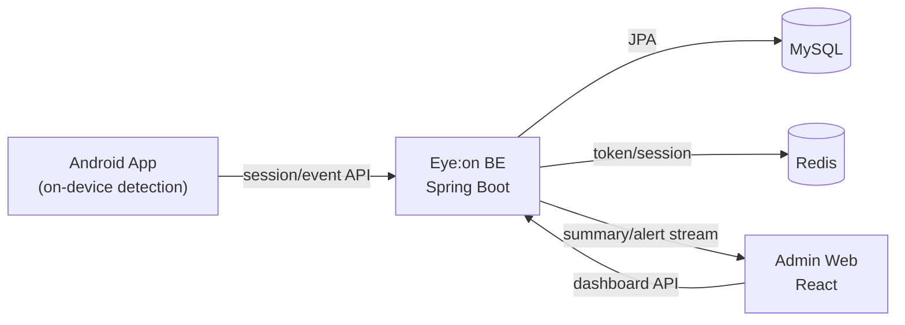

# Eye:on Backend

스마트폰 온디바이스 졸음/피로 감지 서비스 **Eye:on**의 백엔드 서버입니다.

이 서버는 Android 앱에서 전송되는 모니터링 세션/이벤트 데이터를 수집하고,
조직 관리자 웹(대시보드)에서 실시간 현황과 누적 통계를 확인할 수 있도록 API와 실시간 스트림(SSE)을 제공합니다.

---

## 1. 프로젝트 맥락

Eye:on은 눈(Eye)을 ON 상태로 유지한다는 기획 의도 아래,
운전/업무/학습 상황에서 졸음 위험을 낮추는 것을 목표로 합니다.


1. **모니터링 데이터 플랫폼화**
- Android 감지 결과를 세션/이벤트 단위로 안정적으로 수집
- 상태 변화 이력/통계 계산이 가능한 데이터 모델 설계

2. **조직 관리자 관제 지원**
- 관리자 인증/권한 체계
- 실시간 위험 현황, 알림, 위험 사용자 통계 API
- SSE 기반 실시간 대시보드 반영

---

## 2. 구현 범위

### 2.1 BE/FE 범위
- 인증/모니터링/조직관리/통계/실시간 API를 실제 연동 가능한 수준으로 구현

### 2.2 Android 연동 범위
Android는 아래 5개 API를 연동해 사용 중입니다.

- 로그인
- 회원가입
- 모니터링 시작
- 모니터링 종료
- 모니터링 이벤트 전송

즉, **앱 이벤트 수집 -> 서버 저장/집계 -> 관리자 웹 시각화**의 핵심 파이프라인이 연결되어 있습니다.

---

## 3. 아키텍처 개요



### 3.1 백엔드 내부 구조

```text
src/main/java/ac/jwooo/eye_on
├─ domain
│  ├─ auth          # 로그인/회원가입/토큰 재발급/로그아웃
│  ├─ monitoring    # 세션/이벤트/알림/실시간 요약
│  ├─ organization  # 구성원 관리/위험 사용자/통계 조회
│  └─ user          # 내 정보, 조직 코드(개발용 포함)
└─ global
   ├─ config        # Security/CORS/JWT/Swagger/JPA/Web
   ├─ exception     # 에러 코드/전역 예외 핸들러
   └─ security      # JWT 필터/토큰 provider/Redis token store
```

---

## 4. BE 기능 상세

### 4.1 인증/보안
- JWT Access/Refresh 기반 인증
- Redis 기반 토큰 제어
  - refresh token whitelist
  - access/refresh token blacklist
- `X-Client-Type` 헤더 기준 정책 분기
  - `WEB`: refresh token은 HttpOnly 쿠키 관리
  - `APP`: refresh token은 응답 바디 반환
- 웹 로그인은 조직 관리자(`ADMIN`) 계정만 허용
- Spring Security Stateless 세션 + JWT 필터 체계 적용

### 4.2 모니터링 수집 (앱 연동 핵심)
- 세션 시작/종료 API
- 상태 이벤트 API: `NORMAL`, `DROWSY`, `SLEEP`
- 시간 검증 로직
  - 세션 시작 이전 이벤트 차단
  - 세션 종료 이후 이벤트 차단
  - 같은 세션 내 이벤트 역순 시간 차단
- 복구 로직
  - 모바일 네트워크/앱 종료 이슈로 종료 요청이 누락되면,
    신규 시작 전에 기존 active 세션을 보정 종료

### 4.3 조직 관리자 기능
- 구성원 추가/조회/삭제
- 위험 사용자 조회
- 기간 단위 위험 통계 조회 (`HOUR`, `DAY`, `WEEK`, `MONTH`, `YEAR`)
- 관리자 권한 검증 및 타 조직 접근 차단

### 4.4 실시간 대시보드 (SSE)
- 실시간 요약 API
- SSE 스트림 제공
  - `summary`: 실시간 요약
  - `alert`: 경고 알림
  - `heartbeat`: 연결 유지
  - `connected`: 초기 연결 이벤트
- 트랜잭션 커밋 후 push 처리로 저장/전송 일관성 보강

### 4.5 통계 집계
- 최근 24시간 시간대 위험도 API
- 최근 종료 세션 API
- 커서 기반 알림 피드 API
- 일 집계 테이블(`org_daily_stats`, `org_user_daily_stats`) 운영
- 스케줄러
  - 매일 `00:05 (Asia/Seoul)`
  - 최근 2일(D-1, D-2) 재집계

### 4.6 운영 안정성 설계 포인트
- 소프트 삭제(`deleted_at`) 기반 데이터 보존
- TSID 기반 정렬 친화 ID
- BaseEntity audit 필드(`created_at`, `updated_at`, `deleted_at`)
- KST(Asia/Seoul) 기준 시계 처리
- cursor pagination으로 대량 알림 조회 부담 완화

---

## 5. 주요 데이터 모델

| 테이블 | 용도 |
|---|---|
| `users` | 사용자 계정/역할/프로필 |
| `organization_codes` | 조직 코드 레코드 |
| `member` | 조직-사용자 매핑 |
| `monitoring_sessions` | 모니터링 세션 시작/종료/카운트 |
| `monitoring_event_logs` | 상태 변화 이벤트 로그 |
| `notification` | 조직 관리자 알림 피드 |
| `org_daily_stats` | 조직 일 단위 집계 |
| `org_user_daily_stats` | 사용자별 일 단위 집계 |

> 쿼리 성능을 위해 모니터링/알림/멤버십 관련 인덱스를 엔티티/네이티브 쿼리에 맞춰 설계했습니다.

---

## 6. API 빠른 맵

### 6.1 Auth
- `POST /api/auth/signup`
- `POST /api/auth/login`
- `POST /api/auth/refresh`
- `POST /api/auth/logout`

### 6.2 User
- `GET /api/users/me`

### 6.3 Organization
- `POST /api/organizations/members`
- `GET /api/organizations/members`
- `DELETE /api/organizations/members/{memberId}`
- `GET /api/organizations/{organizationId}/risk-users`
- `GET /api/organizations/{organizationId}/analysis/risk-stats`

### 6.4 Monitoring
- `GET /api/monitoring/dashboard/realtime-summary`
- `GET /api/monitoring/dashboard/realtime-summary/stream` (SSE)
- `GET /api/monitoring/dashboard/hourly-risk-24h`
- `GET /api/monitoring/dashboard/recent-ended-sessions`
- `GET /api/monitoring/dashboard/notifications`
- `POST /api/monitoring/sessions/start`
- `POST /api/monitoring/sessions/{sessionId}/end`
- `POST /api/monitoring/sessions/{sessionId}/events`

---

## 7. 요청 예시

### 7.1 회원가입 (APP)
```http
POST /api/auth/signup
X-Client-Type: APP
Content-Type: application/json

{
  "email": "user@example.com",
  "password": "1234",
  "name": "홍길동",
  "nickname": "길동",
  "age": 24,
  "gender": "MALE"
}
```

### 7.2 모니터링 시작
```http
POST /api/monitoring/sessions/start
Authorization: Bearer {accessToken}
Content-Type: application/json

{
  "mode": "DRIVING",
  "startedAtApp": "2026-04-20T10:00:00"
}
```

### 7.3 모니터링 이벤트 전송
```http
POST /api/monitoring/sessions/{sessionId}/events
Authorization: Bearer {accessToken}
Content-Type: application/json

{
  "eventType": "DROWSY",
  "occurredAtApp": "2026-04-20T10:05:12"
}
```

### 7.4 SSE 구독
```http
GET /api/monitoring/dashboard/realtime-summary/stream
Authorization: Bearer {accessToken}
Accept: text/event-stream
```

---

## 8. 인프라 상세

### 8.1 저장소에 포함된 인프라 구성 (현재)
현재 저장소에서 바로 실행 가능한 인프라는 `docker-compose.yml` 기준 다음과 같습니다.

1. **MySQL 8.4 (`eyeon-mysql`)**
- 포트: `${MYSQL_PORT:-3306}`
- 볼륨: `mysql-data:/var/lib/mysql`
- healthcheck: `mysqladmin ping`
- 타임존: `Asia/Seoul`

2. **Redis 7.2-alpine (`eyeon-redis`)**
- 포트: `${REDIS_PORT:-6379}`
- 볼륨: `redis-data:/data`
- AOF 활성화: `--appendonly yes`
- 비밀번호 보호: `--requirepass`
- healthcheck: `redis-cli ping`

### 8.2 백엔드 런타임 설정 전략
- `src/main/resources/application.properties` + `.env` 조합
- 핵심 설정 분리
  - DB 접속
  - Redis 접속
  - JWT 시크릿/만료시간
  - 쿠키 정책(`secure`, `same-site`, `domain`)
  - CORS 허용 origin
  - Swagger/dev API 노출 토글

### 8.3 네트워크/보안 운영 포인트
- 인증이 필요한 API는 기본적으로 JWT 필요
- CORS는 explicit origin만 허용(와일드카드 미지원)
- 쿠키 기반 WEB 로그인 테스트 시 로컬 환경에서는 `COOKIE_SECURE=false` 필요
- 운영에서는 `COOKIE_SECURE=true`, HTTPS 종단 필수

### 8.4 로컬 배포 절차 (개발자 온보딩)

1. 인프라 기동
```bash
cd BE
docker compose up -d
```

2. 환경 변수 설정 (보안을 위해 생략)
```

3. 서버 실행
```bash
./gradlew bootRun
```

4. 확인
- 기본 포트: `8080`


## 9. 클라이언트 타입 정책

모든 인증 요청에서 `X-Client-Type` 헤더를 사용합니다.

- `X-Client-Type: WEB`
  - refresh token을 HttpOnly cookie로 발급/갱신
  - 웹 관리자 로그인 정책 적용

- `X-Client-Type: APP`
  - refresh token을 응답 바디로 반환
  - Android 앱 연동 정책

참고: 서버 코드상 `APP`이 기본값으로 처리되므로, 헤더 누락 시 앱 정책으로 동작합니다.

---

## 10. 현재 상태와 다음 단계

### 10.1 현재 상태
- 인증 + 모니터링 수집 + 조직 관리자 통계 + SSE 실시간 연동까지 구현
- Android 핵심 API 5종 연동 완료(로그인/회원가입/시작/종료/이벤트)

### 10.2 다음 단계
- 친구/랭킹 도메인 확장
- 스터디 집중도 고도화 지표 연동
- LLM 기반 대화형 각성 기능 연동 준비
- 배포 자동화(CI/CD) 및 운영 관측 체계 고도화

---