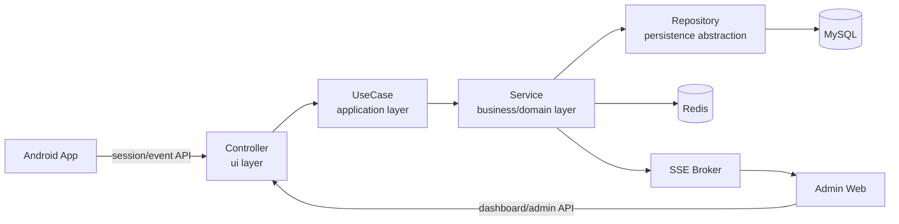

# Eye:on Backend

스마트폰 온디바이스 졸음 감지 결과를 수집하고, 조직 관리자 대시보드에 실시간 위험 현황과 통계를 제공하는 Eye:on 백엔드 서버입니다.

Eye:on Backend는 Android 앱, 관리자 Web, MySQL, Redis를 연결하는 API 서버이며 인증, 모니터링 세션/이벤트 저장, 알림 피드, 조직 구성원 관리, 통계 집계, SSE 실시간 스트림을 담당합니다.

## Table Of Contents

- [Features](#features)
- [Architecture](#architecture)
- [Tech Stack](#tech-stack)
- [Getting Started](#getting-started)
- [Environment Variables](#environment-variables)
- [API Documentation](#api-documentation)
- [Project Structure](#project-structure)
- [Run Tests](#run-tests)
- [Deployment](#deployment)
- [Wiki](#wiki)

## Features

| Area | Description |
| --- | --- |
| Auth | JWT Access/Refresh 인증, Redis 기반 refresh whitelist 및 token blacklist, WEB/APP 클라이언트별 refresh token 전달 방식 분리 |
| Monitoring | 모니터링 세션 시작/종료, 졸음/수면/정상 이벤트 수집, 세션별 위험 이벤트 카운트 |
| Dashboard | 실시간 요약, 최근 24시간 위험도, 최근 종료 세션, 알림 피드 조회 |
| Realtime | `text/event-stream` 기반 SSE 스트림으로 `summary`, `alert`, `heartbeat`, `connected` 이벤트 전송 |
| Organization | 조직 관리자 구성원 추가/조회/삭제, 위험 사용자 조회, 기간별 위험 통계 조회 |
| System Admin | 조직 가입 신청 조회, 승인, 거절 |
| AI Agent | 구독 사용자 대상 Gemini 기반 AI 동승자 설정 및 채팅 API |

## Architecture

이 프로젝트는 DDD의 도메인 분리 방식과 레이어드 아키텍처를 섞어 설계했습니다. 패키지는 `auth`, `monitoring`, `organization`, `user`, `agent` 같은 도메인 단위로 나뉘고, 각 도메인 안에서 Controller, UseCase, Service, Repository 흐름을 유지합니다.



Layer responsibilities:

| Layer | Package | Responsibility |
| --- | --- | --- |
| Controller | `domain/*/ui` | HTTP 요청/응답, 인증 principal 추출, request validation 진입점 |
| UseCase | `domain/*/application/usecase` | 화면/기능 단위 application flow 조합 |
| DTO | `domain/*/application/dto` | API request/response 모델 |
| Domain Entity | `domain/*/domain/entity` | 핵심 상태와 비즈니스 메서드 |
| Domain Service | `domain/*/domain/service` | 도메인 규칙, 권한 검증, 외부 API 호출, 통계/알림 처리 |
| Repository | `domain/*/domain/repository` | JPA query abstraction 및 projection |
| Global | `global/*` | Security, JWT, CORS, Swagger, exception, JPA 공통 설정 |

## Tech Stack

| Category | Library / Tool |
| --- | --- |
| Language | Java 17 |
| Framework | Spring Boot 4.0.5 |
| Web | Spring WebMVC |
| Security | Spring Security, JWT (`io.jsonwebtoken:jjwt`) |
| Persistence | Spring Data JPA, Hibernate, MySQL Connector/J |
| Cache / Token Store | Spring Data Redis, Redis 7.2 |
| Validation | Jakarta Validation |
| API Docs | SpringDoc OpenAPI, Swagger UI |
| ID Strategy | Hypersistence Utils TSID |
| Build | Gradle |
| Infra | Docker Compose for MySQL and Redis |
| AI | Gemini API client |

## Getting Started

### Prerequisites

- JDK 17
- Docker and Docker Compose
- Gradle Wrapper included in repository
- MySQL and Redis can be started through `docker-compose.yml`

### 1. Clone

```bash
git clone https://github.com/Eye-on-P-project/BE.git
cd BE
```

### 2. Configure Environment

```bash
cp .env.example .env
```

Fill `.env` with local values. For local development, `COOKIE_SECURE=false` is recommended unless HTTPS is configured.

### 3. Start Infra

```bash
docker compose up -d mysql redis
```

### 4. Run Server

```bash
./gradlew bootRun
```

The API server starts on `http://localhost:8080` by default.

### 5. Open Swagger UI

Set `EXPOSE_SWAGGER=true` in `.env`, restart the server, then open:

```text
http://localhost:8080/swagger-ui.html
```

## Environment Variables

| Name | Required | Default | Description |
| --- | --- | --- | --- |
| `PORT` | No | `8080` | Spring Boot server port |
| `MYSQL_HOST` | No | `localhost` | MySQL host |
| `MYSQL_PORT` | No | `3306` | MySQL port |
| `MYSQL_DATABASE` | No | `eye_on` | MySQL database |
| `MYSQL_USER` | Yes | - | MySQL user |
| `MYSQL_PASSWORD` | Yes | - | MySQL password |
| `MYSQL_ROOT_PASSWORD` | Yes for docker compose | - | MySQL root password |
| `REDIS_HOST` | No | `localhost` | Redis host |
| `REDIS_PORT` | No | `6379` | Redis port |
| `REDIS_PASSWORD` | Yes | - | Redis password |
| `JWT_SECRET` | Yes | - | JWT signing secret |
| `JWT_ACCESS_EXP` | No | `900` | Access token TTL seconds |
| `JWT_REFRESH_EXP` | No | `1209600` | Refresh token TTL seconds |
| `COOKIE_SECURE` | No | `false` | Refresh cookie Secure flag |
| `COOKIE_SAMESITE` | No | `Lax` | Refresh cookie SameSite policy |
| `COOKIE_DOMAIN` | No | empty | Refresh cookie domain |
| `ALLOWED_ORIGINS` | No | `http://localhost:5173` | Comma-separated CORS origins |
| `EXPOSE_SWAGGER` | No | `false` | Whether Swagger UI and OpenAPI JSON are public |
| `GEMINI_PROVIDER` | No | `vertex` | Gemini provider: `vertex` uses GCP Vertex AI; `ai-studio` uses Gemini API key |
| `GEMINI_API_KEY` | No | empty | Gemini API key, only used when `GEMINI_PROVIDER=ai-studio` |
| `GEMINI_MODEL` | No | `gemini-2.5-flash` | Gemini model name |
| `GEMINI_ENDPOINT` | No | Google Generative Language endpoint | AI Studio Gemini API endpoint |
| `GEMINI_VERTEX_ENDPOINT` | No | region-derived Vertex AI endpoint | Optional Vertex AI endpoint override |
| `GCP_PROJECT_ID` | No on GCE | metadata server project ID | GCP project ID for Vertex AI; auto-discovered on GCE if empty |
| `GCP_LOCATION` | No | `global` | Vertex AI location. Use `global` to reduce regional PayGo 429s |
| `GEMINI_TIMEOUT_SECONDS` | No | `8` | Gemini request timeout |
| `GEMINI_MAX_OUTPUT_TOKENS` | No | `512` | Gemini response token limit |
| `GEMINI_THINKING_BUDGET` | No | `0` | Gemini thinking budget |

### Vertex AI Gemini on GCP

To spend Google Cloud credits instead of AI Studio prepay credits, run the backend with Vertex AI:

```properties
GEMINI_PROVIDER=vertex
GEMINI_MODEL=gemini-2.5-flash
GCP_LOCATION=global
```

On a GCE VM, the backend uses the VM service account through Application Default Credentials. Make sure the project has the Vertex AI/Gemini API enabled and the VM service account has a Vertex AI role such as `Vertex AI User`.

To use the old AI Studio API key path:

```properties
GEMINI_PROVIDER=ai-studio
GEMINI_API_KEY=your-api-key
```

## API Documentation

Most APIs except auth endpoints require:

```http
Authorization: Bearer {accessToken}
```

Auth APIs also use:

```http
X-Client-Type: APP
```

`X-Client-Type` can be `APP` or `WEB`. If omitted, the backend treats the request as `APP`.

Quick endpoint map:

| Domain | Method | Path | Description |
| --- | --- | --- | --- |
| Auth | `POST` | `/api/auth/signup` | APP user signup or WEB organization admin signup |
| Auth | `POST` | `/api/auth/login` | Login and issue tokens |
| Auth | `POST` | `/api/auth/refresh` | Rotate refresh token and reissue access token |
| Auth | `POST` | `/api/auth/logout` | Blacklist token and clear refresh state |
| User | `GET` | `/api/users/me` | Get current user |
| User | `PATCH` | `/api/users/me/password` | Change password with organization code check |
| Monitoring | `POST` | `/api/monitoring/sessions/start` | Start monitoring session |
| Monitoring | `POST` | `/api/monitoring/sessions/{sessionId}/events` | Create monitoring event |
| Monitoring | `POST` | `/api/monitoring/sessions/{sessionId}/end` | End monitoring session |
| Monitoring | `GET` | `/api/monitoring/dashboard/realtime-summary` | Dashboard realtime summary |
| Monitoring | `GET` | `/api/monitoring/dashboard/realtime-summary/stream` | SSE realtime summary and alert stream |
| Monitoring | `GET` | `/api/monitoring/dashboard/hourly-risk-24h` | Last 24h hourly risk count |
| Monitoring | `GET` | `/api/monitoring/dashboard/recent-ended-sessions` | Recent ended sessions |
| Monitoring | `GET` | `/api/monitoring/dashboard/notifications` | Cursor-based notification feed |
| Organization | `POST` | `/api/organizations/members` | Add member by email |
| Organization | `GET` | `/api/organizations/members` | List organization members |
| Organization | `DELETE` | `/api/organizations/members/{memberId}` | Remove member |
| Organization | `GET` | `/api/organizations/{organizationId}/risk-users` | List risky users |
| Organization | `GET` | `/api/organizations/{organizationId}/analysis/risk-stats` | Aggregated risk statistics |
| System Admin | `GET` | `/api/system-admin/organizations/signups` | List organization signup requests |
| System Admin | `GET` | `/api/system-admin/organizations/signups/{organizationId}` | Get signup request detail |
| System Admin | `PATCH` | `/api/system-admin/organizations/signups/{organizationId}/approve` | Approve organization |
| System Admin | `PATCH` | `/api/system-admin/organizations/signups/{organizationId}/reject` | Reject organization |
| Agent | `GET` | `/api/agent/config` | Get AI agent availability |
| Agent | `POST` | `/api/agent/chat` | Chat with AI agent |

For detailed request/response fields and copy-paste examples, see [wiki/API-Reference.md](wiki/API-Reference.md) and [wiki/Usage-Examples.md](wiki/Usage-Examples.md).

## Project Structure

```text
src/main/java/ac/jwooo/eye_on
├─ EyeOnApplication.java
├─ domain
│  ├─ agent
│  ├─ auth
│  ├─ monitoring
│  ├─ organization
│  └─ user
└─ global
   ├─ common
   ├─ config
   ├─ exception
   └─ security
```

## Run Tests

```bash
./gradlew test
```

For a lighter compile check:

```bash
./gradlew compileJava
```

## Deployment

The repository includes a VM deployment helper:

```bash
deploy/deploy.sh
```

It pulls the target branch, starts MySQL/Redis with Docker Compose, builds `bootJar`, and restarts a systemd service. See the deployment guide in the existing local docs directory if available.

## Wiki

- [Wiki Home](wiki/Home.md)
- [Project Overview](wiki/Project-Overview.md)
- [Installation And Environment](wiki/Installation-And-Environment.md)
- [Backend Architecture](wiki/Backend-Architecture.md)
- [Diagrams](wiki/Diagrams.md)
- [API Reference](wiki/API-Reference.md)
- [Usage Examples](wiki/Usage-Examples.md)
