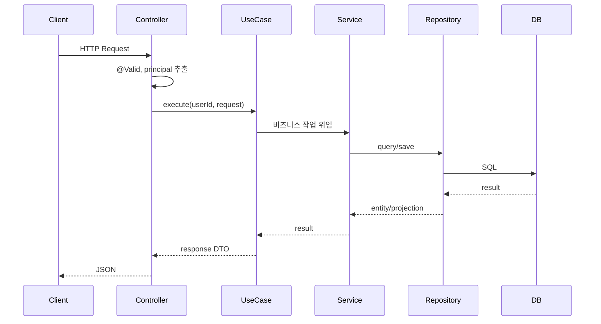
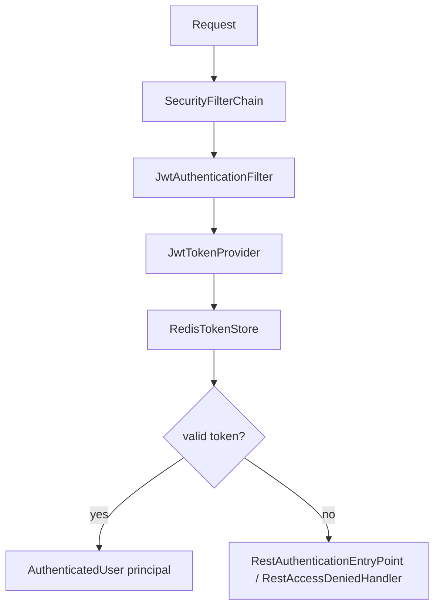
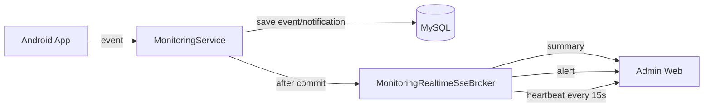

# Backend Architecture

## 설계 의도

Eye:on Backend는 DDD와 Layered Architecture를 함께 사용합니다. 
전체 패키지는 도메인 단위로 나누고, 각 도메인 안에서는 Controller, UseCase, Service, Repository 흐름을 유지하는 구조입니다.

목표는 다음과 같습니다.

- 기능 변경이 특정 도메인 패키지 안에서 끝나도록 응집도를 높입니다.
- HTTP, application flow, domain rule, persistence 관심사를 분리합니다.
- 관리자 Web, Android App, System Admin 기능이 같은 서버 안에서 충돌하지 않도록 경계를 둡니다.
- 비즈니스 규칙은 Controller가 아니라 UseCase/Service/Entity 쪽에 둡니다.

## Package Structure

```text
src/main/java/ac/jwooo/eye_on
├─ domain
│  ├─ auth
│  │  ├─ ui
│  │  ├─ application/dto
│  │  └─ domain
│  ├─ monitoring
│  │  ├─ ui
│  │  ├─ application/dto
│  │  └─ domain
│  ├─ organization
│  │  ├─ ui
│  │  ├─ application/dto
│  │  ├─ application/usecase
│  │  └─ domain
│  ├─ user
│  └─ agent
└─ global
   ├─ common
   ├─ config
   ├─ exception
   └─ security
```

## Layer Mapping

| Intended Layer | Actual Package | Example | Responsibility |
| --- | --- | --- | --- |
| Controller | `domain/*/ui` | `MonitoringController` | API path mapping, request body validation, authenticated user extraction |
| Controller Spec | `domain/*/ui/spec` | `MonitoringControllerSpec` | Swagger/OpenAPI annotation 분리 |
| UseCase | `domain/*/application/usecase` | `GetOrganizationRiskStatsUseCase` | 기능 단위 orchestration |
| DTO | `domain/*/application/dto` | `StartMonitoringSessionRequest` | request/response contract |
| Service | `domain/*/domain/service` | `MonitoringServiceImpl` | 도메인 규칙, 트랜잭션, 외부 연동 |
| Repository | `domain/*/domain/repository` | `MonitoringSessionRepository` | persistence abstraction, query, projection |
| Entity | `domain/*/domain/entity` | `MonitoringSession` | 도메인 상태와 상태 변경 메서드 |
| Global | `global/*` | `SecurityConfig`, `JwtTokenProvider` | cross-cutting concern |

## Request Flow


 
새 기능은 `Controller -> UseCase -> Service -> Repository` 흐름을 따라야합니다.

## Domain Boundaries

### Auth

- 위치: `domain/auth`
- 책임: 회원가입, 로그인, refresh token rotation, logout
- 주요 클래스:
  - `AuthController`
  - `AuthService`, `AuthServiceImpl`
  - `ClientType`
  - `AuthTokenResponse`

### Monitoring

- 위치: `domain/monitoring`
- 책임: 세션 시작/종료, 이벤트 생성, 대시보드 조회, SSE push
- 주요 클래스:
  - `MonitoringController`
  - `MonitoringService`, `MonitoringServiceImpl`
  - `MonitoringRealtimeSseBroker`
  - `MonitoringSession`, `MonitoringEventLog`, `Notification`

### Organization

- 위치: `domain/organization`
- 책임: 구성원 관리, 위험 사용자 조회, 통계 조회, 조직 가입 심사
- 주요 클래스:
  - `OrganizationMemberController`
  - `OrganizationRiskUserController`
  - `SystemAdminOrganizationController`
  - `GetOrganizationRiskStatsUseCase`
  - `OrganizationAccessService`

### User

- 위치: `domain/user`
- 책임: 사용자/조직 엔티티, 내 정보 조회, 비밀번호 변경
- 주요 클래스:
  - `UserController`
  - `User`, `Organization`
  - `UserQueryService`, `UserPasswordService`

### Agent

- 위치: `domain/agent`
- 책임: AI 동승자 설정, 구독 체크, Gemini 응답 생성
- 주요 클래스:
  - `AgentController`
  - `GetAgentConfigUseCase`
  - `ChatWithAgentUseCase`
  - `GeminiAgentClient`

## Security Architecture



보안 정책:

- Spring Security는 stateless session 정책을 사용합니다.
- `/api/auth/signup`, `/api/auth/login`, `/api/auth/refresh`, `/api/auth/logout`은 인증 없이 접근 가능합니다.
- 나머지 API는 JWT access token이 필요합니다.
- Refresh token은 Redis whitelist에 저장됩니다.
- Logout 또는 refresh rotation 시 access/refresh token jti가 blacklist에 저장됩니다.
- WEB 클라이언트 refresh token은 HttpOnly cookie로 내려가고, APP 클라이언트 refresh token은 response body로 내려갑니다.

## Realtime Architecture



SSE event types:

| Event | Description |
| --- | --- |
| `connected` | SSE 연결 직후 organizationId와 connectedAt 전달 |
| `summary` | 실시간 대시보드 요약 |
| `alert` | 위험 이벤트 알림 |
| `heartbeat` | 15초 주기 연결 유지 이벤트 |

## Persistence Strategy

- ID는 TSID를 사용해 시간 정렬 친화적인 Long ID를 생성합니다.
- 공통 엔티티는 `BaseEntity`의 `createdAt`, `updatedAt`, `deletedAt`을 상속합니다.
- 삭제는 `deletedAt` 기반 soft delete 형태를 고려한 쿼리 패턴을 사용합니다.
- 대시보드 조회 성능을 위해 projection과 native query를 활용합니다.
- 대량 알림 피드는 cursor pagination을 사용합니다.
- 일 단위 통계는 `org_daily_stats`, `org_user_daily_stats`에 집계합니다.

## Extension Guide

새 API를 추가할 때 권장 흐름:

1. `domain/{bounded-context}/application/dto`에 request/response DTO를 추가합니다.
2. 단일 기능 흐름이 필요하면 `application/usecase`에 UseCase를 추가합니다.
3. 핵심 규칙은 `domain/service` 또는 entity 메서드에 둡니다.
4. DB 접근은 `domain/repository`에 추가합니다.
5. HTTP endpoint는 `ui` Controller에 추가합니다.
6. Swagger 설명이 필요하면 `ui/spec` interface에 annotation을 분리합니다.
7. 예외는 가능하면 `ErrorCode`와 `CustomException`을 사용해 일관된 JSON 형식으로 반환합니다.
