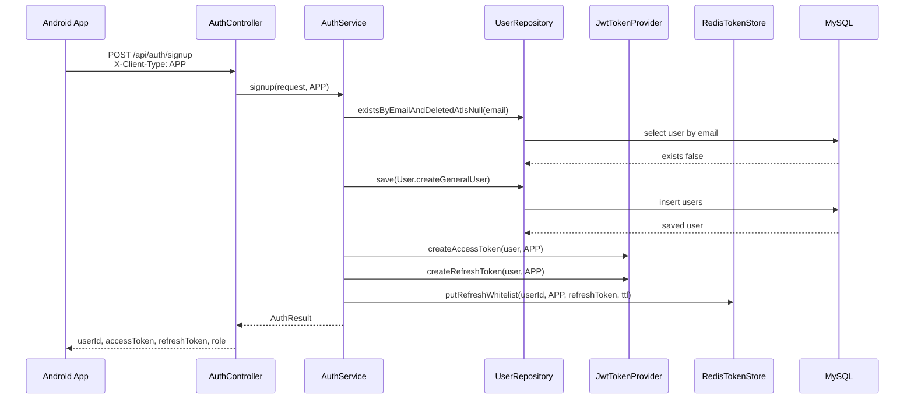
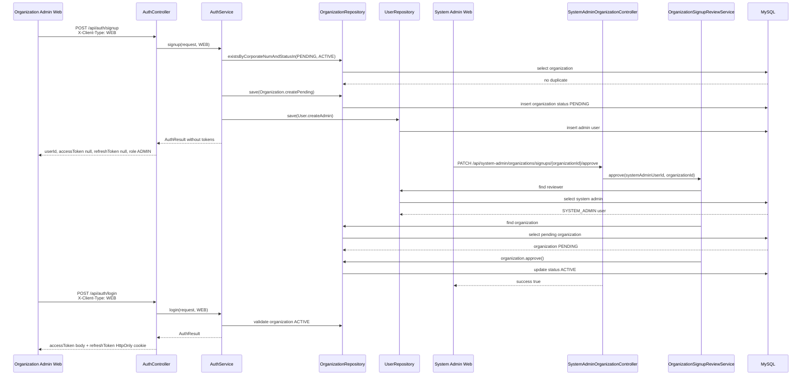
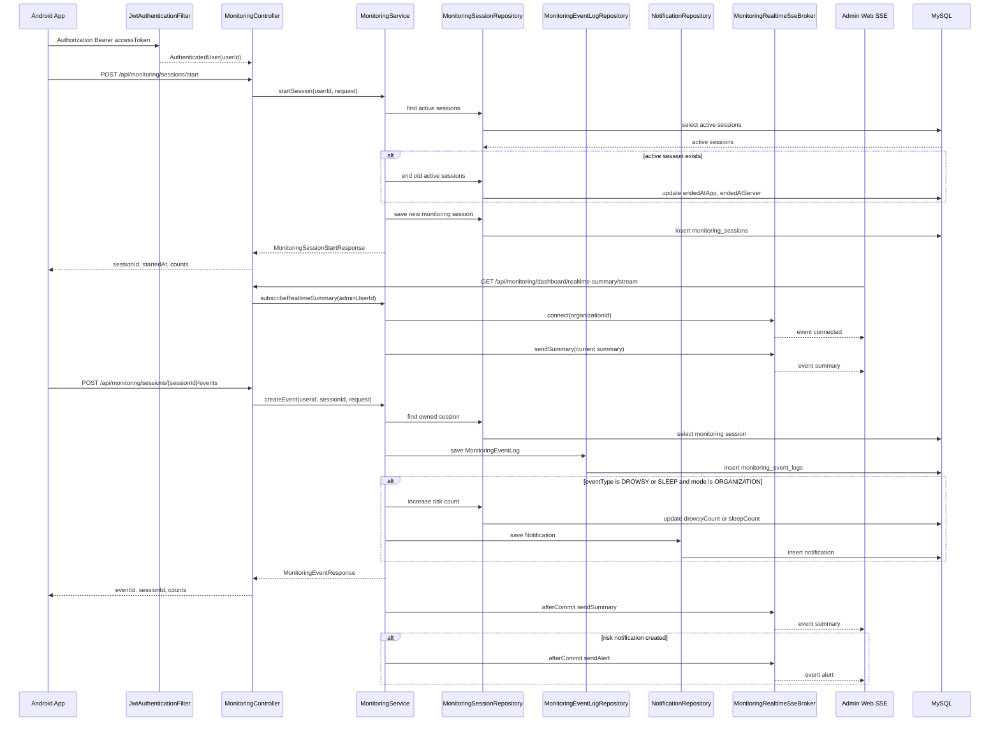
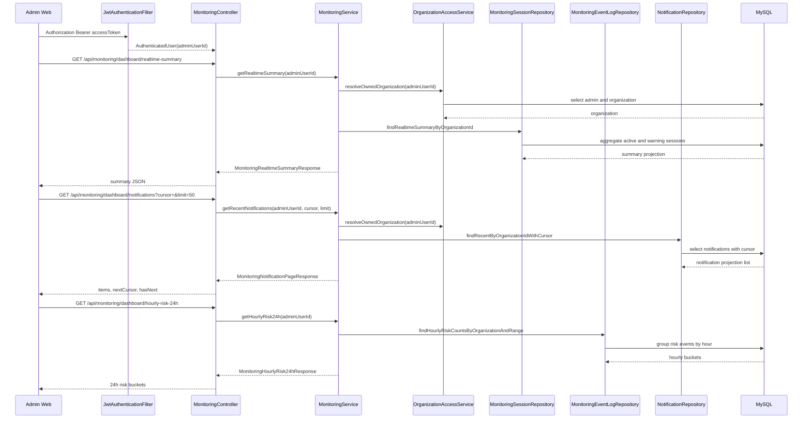
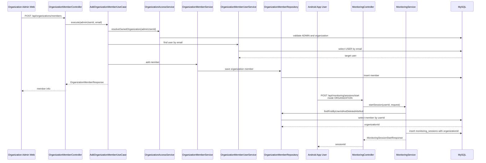
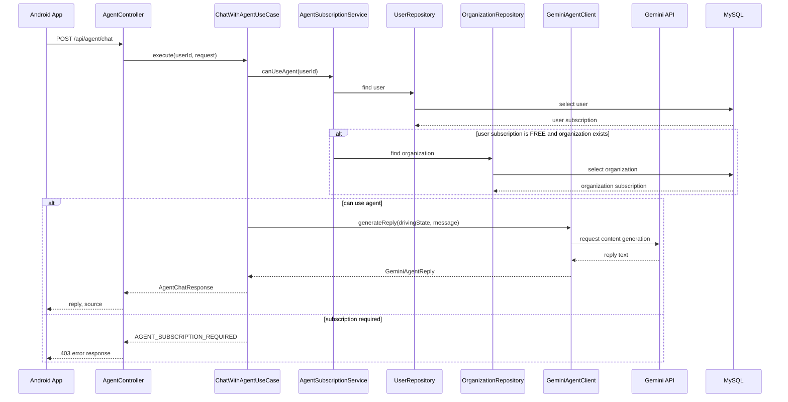

# Diagrams

이 문서는 Eye:on Backend의 주요 Usecase와 핵심 Sequence를 Mermaid 다이어그램으로 정리합니다. GitHub Markdown과 대부분의 문서 도구에서 바로 렌더링할 수 있습니다.

## Usecase Diagram

```mermaid
flowchart LR
  AppUser["일반 사용자\nAndroid App"]:::actor
  OrgAdmin["조직 관리자\nAdmin Web"]:::actor
  SysAdmin["시스템 관리자\nAdmin Web"]:::actor
  Gemini["Gemini API"]:::external

  subgraph Backend["Eye:on Backend"]
    UCSignupApp(("APP 회원가입"))
    UCLoginApp(("APP 로그인"))
    UCRefresh(("토큰 재발급"))
    UCLogout(("로그아웃"))
    UCMe(("내 정보 조회"))
    UCPassword(("비밀번호 변경"))

    UCStartSession(("모니터링 세션 시작"))
    UCCreateEvent(("상태 이벤트 전송"))
    UCEndSession(("모니터링 세션 종료"))
    UCAgentConfig(("AI Agent 설정 조회"))
    UCAgentChat(("AI Agent 대화"))

    UCSignupOrg(("조직 관리자 가입 신청"))
    UCLoginWeb(("WEB 관리자 로그인"))
    UCMemberAdd(("조직 구성원 추가"))
    UCMemberList(("조직 구성원 조회"))
    UCMemberRemove(("조직 구성원 삭제"))
    UCRiskUsers(("위험 사용자 조회"))
    UCRiskStats(("기간별 위험 통계 조회"))
    UCDashboard(("대시보드 요약 조회"))
    UCSse(("실시간 SSE 구독"))
    UCNotifications(("알림 피드 조회"))
    UCRecentSessions(("최근 종료 세션 조회"))

    UCReviewList(("조직 가입 신청 목록 조회"))
    UCReviewDetail(("조직 가입 신청 상세 조회"))
    UCApprove(("조직 가입 승인"))
    UCReject(("조직 가입 거절"))
  end

  AppUser --> UCSignupApp
  AppUser --> UCLoginApp
  AppUser --> UCRefresh
  AppUser --> UCLogout
  AppUser --> UCMe
  AppUser --> UCPassword
  AppUser --> UCStartSession
  AppUser --> UCCreateEvent
  AppUser --> UCEndSession
  AppUser --> UCAgentConfig
  AppUser --> UCAgentChat

  OrgAdmin --> UCSignupOrg
  OrgAdmin --> UCLoginWeb
  OrgAdmin --> UCRefresh
  OrgAdmin --> UCLogout
  OrgAdmin --> UCMe
  OrgAdmin --> UCMemberAdd
  OrgAdmin --> UCMemberList
  OrgAdmin --> UCMemberRemove
  OrgAdmin --> UCRiskUsers
  OrgAdmin --> UCRiskStats
  OrgAdmin --> UCDashboard
  OrgAdmin --> UCSse
  OrgAdmin --> UCNotifications
  OrgAdmin --> UCRecentSessions

  SysAdmin --> UCLoginWeb
  SysAdmin --> UCReviewList
  SysAdmin --> UCReviewDetail
  SysAdmin --> UCApprove
  SysAdmin --> UCReject

  UCAgentChat -. "LLM 응답 생성" .-> Gemini
  UCCreateEvent -. "위험 이벤트 발생 시" .-> UCNotifications
  UCCreateEvent -. "ORGANIZATION 모드일 때" .-> UCSse
  UCApprove -. "승인 후" .-> UCLoginWeb
  UCMemberAdd -. "구성원 등록 후" .-> UCStartSession

  classDef actor fill:#f8fafc,stroke:#334155,stroke-width:1.5px,color:#0f172a;
  classDef external fill:#fff7ed,stroke:#f97316,stroke-width:1.5px,color:#9a3412;
```

## Sequence Diagram 1. APP 회원가입/로그인

## Sequence Diagram 2. WEB 조직 관리자 가입 신청과 승인

## Sequence Diagram 3. 모니터링 세션/이벤트 수집과 SSE Push

## Sequence Diagram 4. 관리자 대시보드 조회

## Sequence Diagram 5. 조직 구성원 추가 후 조직 모니터링 시작

## Sequence Diagram 6. AI Agent 대화

