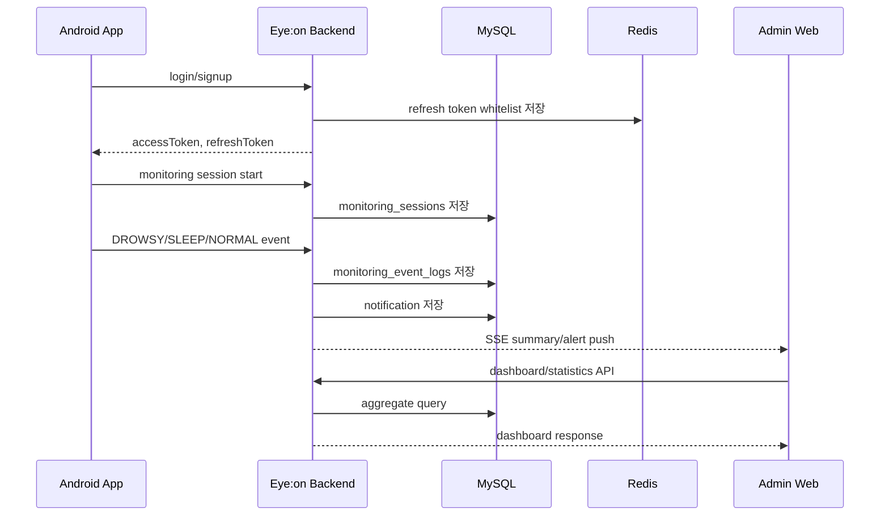

# Eye:on Backend Wiki

이 위키는 Eye:on Backend를 처음 보는 사람이 프로젝트 목적, 실행 환경, 아키텍처, API 사용법을 빠르게 이해하고 바로 연동할 수 있도록 작성한 문서입니다.

## Pages

| Page | Description |
| --- | --- |
| [Project Overview](Project-Overview.md) | 프로젝트 개요, 핵심 기능, 데이터 흐름 |
| [Installation And Environment](Installation-And-Environment.md) | 설치 방법, 환경변수, 라이브러리, 로컬 실행 |
| [Backend Architecture](Backend-Architecture.md) | DDD + Layered Architecture 패키지 설계 |
| [Diagrams](Diagrams.md) | Usecase 다이어그램과 핵심 Sequence 다이어그램 |
| [API Reference](API-Reference.md) | API별 인증, 요청, 응답, 비즈니스 규칙 |
| [Usage Examples](Usage-Examples.md) | curl, JavaScript, Android/Kotlin 예제 코드 |

## Recommended Reading Order

1. 프로젝트를 이해하려면 [Project Overview](Project-Overview.md)를 먼저 읽습니다.
2. 로컬에서 실행하려면 [Installation And Environment](Installation-And-Environment.md)를 봅니다.
3. 전체 기능 관계와 주요 흐름을 보려면 [Diagrams](Diagrams.md)를 확인합니다.
4. 코드를 수정하거나 확장하려면 [Backend Architecture](Backend-Architecture.md)를 확인합니다.
5. 클라이언트 연동을 시작하려면 [API Reference](API-Reference.md)와 [Usage Examples](Usage-Examples.md)를 함께 봅니다.

## Service Summary

Eye:on Backend는 Android 앱이 전송한 모니터링 세션과 상태 이벤트를 저장하고, 조직 관리자 Web에서 실시간 위험 현황과 누적 통계를 확인할 수 있게 하는 Spring Boot API 서버입니다.

주요 흐름은 다음과 같습니다.

