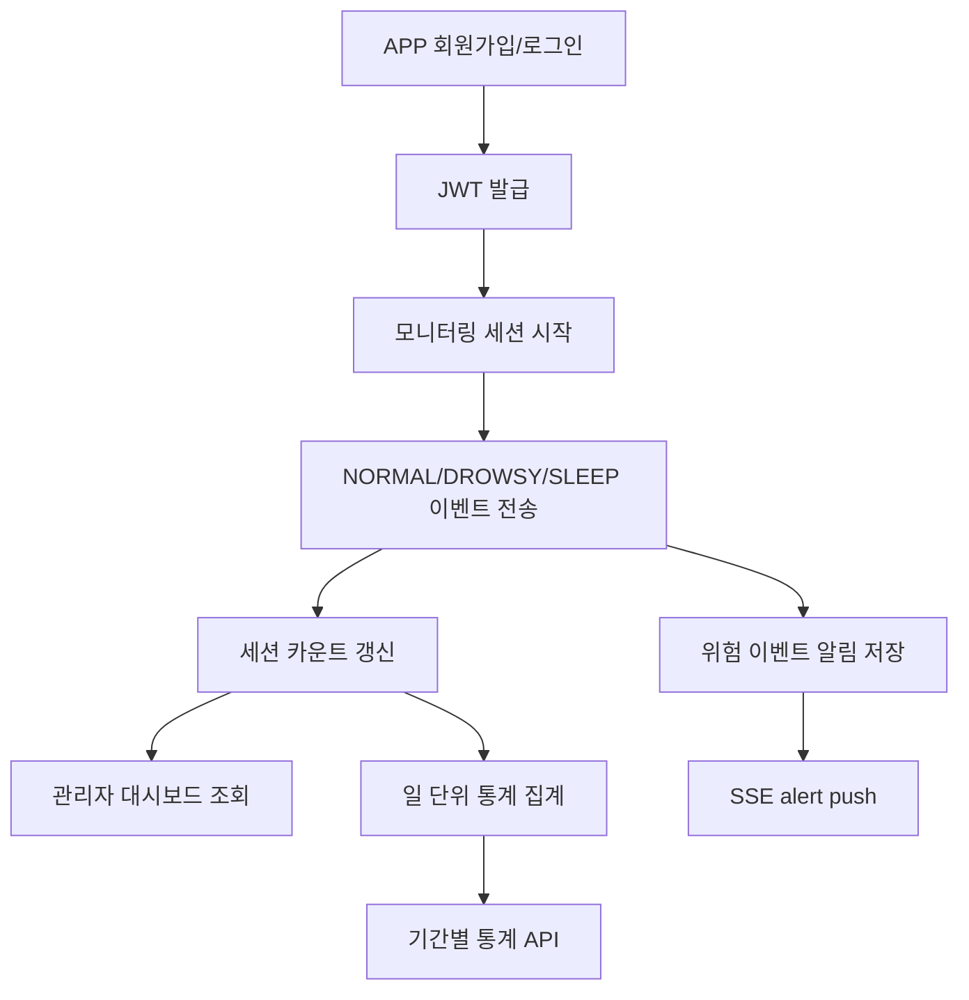

# Project Overview

## 프로젝트 개요

Eye:on은 스마트폰에서 수행한 온디바이스 졸음/피로 감지 결과를 서버로 수집하고, 조직 단위로 위험 상태를 관제할 수 있도록 돕는 서비스입니다.

Backend는 다음 역할을 맡습니다.

| Role | Description |
| --- | --- |
| 인증 서버 | APP/WEB 클라이언트 로그인, 회원가입, JWT 발급/갱신/로그아웃 |
| 이벤트 수집 서버 | Android 앱의 모니터링 세션과 `NORMAL`, `DROWSY`, `SLEEP` 이벤트 저장 |
| 관제 API 서버 | 관리자 Web이 실시간 요약, 최근 종료 세션, 알림 피드, 통계 데이터를 조회 |
| 실시간 브로커 | SSE로 관리자 Web에 `summary`, `alert`, `heartbeat` 이벤트 전달 |
| 조직 관리 서버 | 조직 관리자 구성원 관리, 위험 사용자 조회, 기간별 위험 통계 제공 |
| 시스템 관리자 서버 | 조직 가입 신청 승인/거절 워크플로 제공 |
| AI 동승자 서버 | 구독 사용자에게 Gemini 기반 대화 응답 제공 |

## 사용자 유형

| User Type | Role | Main Client | Description |
| --- | --- | --- | --- |
| 일반 사용자 | `USER` | Android App | 졸음 감지 모니터링을 시작하고 이벤트를 서버에 전송합니다. |
| 조직 관리자 | `ADMIN` | Web | 조직 구성원을 관리하고 대시보드에서 위험 상태를 확인합니다. |
| 시스템 관리자 | `SYSTEM_ADMIN` | Web/Admin Tool | 조직 가입 신청을 승인하거나 거절합니다. |

## 핵심 도메인

| Domain | Package | Description |
| --- | --- | --- |
| Auth | `domain/auth` | 회원가입, 로그인, refresh, logout |
| User | `domain/user` | 내 정보 조회, 비밀번호 변경, 사용자/조직 엔티티 |
| Monitoring | `domain/monitoring` | 세션, 이벤트, 알림, 대시보드, SSE |
| Organization | `domain/organization` | 구성원, 위험 사용자, 통계, 가입 심사 |
| Agent | `domain/agent` | AI 동승자 설정과 채팅 |

## 서비스 데이터 흐름

## 주요 비즈니스 규칙

- `X-Client-Type`은 `APP`, `WEB`을 지원하며 미입력 시 `APP`으로 처리합니다.
- APP 회원가입은 일반 사용자 프로필(`name`, `nickname`, `age`, `gender`)이 필요합니다.
- WEB 회원가입은 조직 관리자 가입 신청으로 처리되며 조직 정보가 필요합니다.
- WEB 로그인은 `ADMIN`, `SYSTEM_ADMIN`만 허용합니다.
- 조직 관리자 계정은 조직 신청이 `ACTIVE`가 되기 전까지 WEB 로그인이 거부됩니다.
- `ORGANIZATION` 모드로 세션을 시작하려면 사용자가 조직 구성원으로 등록되어 있어야 합니다.
- 세션 시작 시 종료되지 않은 기존 active 세션이 있으면 서버가 현재 시각 기준으로 보정 종료한 뒤 새 세션을 시작합니다.
- 위험 이벤트는 `DROWSY`, `SLEEP`이며 세션의 위험 카운트와 관리자 알림에 반영됩니다.
- `NORMAL` 이벤트는 실시간 스트림에는 정상 복귀 알림으로 전달될 수 있지만 알림 테이블에는 저장하지 않습니다.
- 관리자 대시보드 API는 인증 사용자의 소유 조직 기준으로 접근 권한을 검증합니다.

## 데이터 저장소

| Table | Entity | Description |
| --- | --- | --- |
| `users` | `User` | 사용자 계정, 역할, 프로필, 구독 |
| `organization` | `Organization` | 조직 가입 정보, 조직 코드, 상태 |
| `member` | `OrganizationMember` | 조직-사용자 구성원 매핑 |
| `monitoring_sessions` | `MonitoringSession` | 모니터링 세션 시작/종료 및 이벤트 카운트 |
| `monitoring_event_logs` | `MonitoringEventLog` | 세션 내 상태 이벤트 로그 |
| `notification` | `Notification` | 조직 관리자 알림 피드 |
| `org_daily_stats` | `OrganizationDailyRiskStat` | 조직 일 단위 위험 집계 |
| `org_user_daily_stats` | `OrganizationUserDailyRiskStat` | 사용자별 일 단위 위험 집계 |
